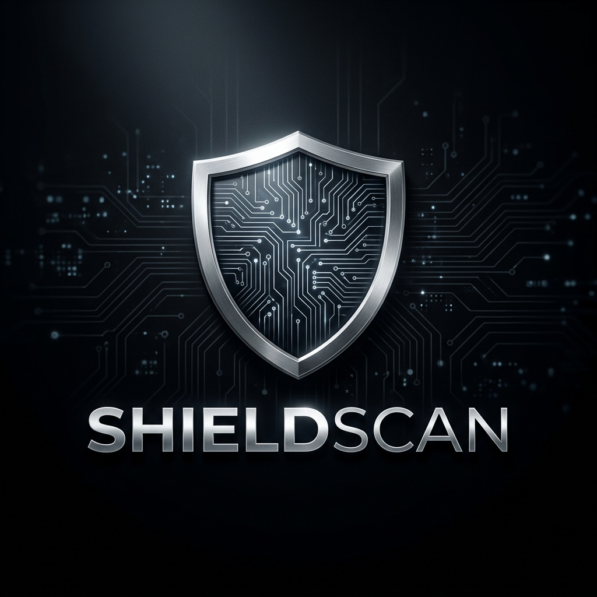

<div align="center">
  
  <br />
  <h1>🛡️ ShieldScan</h1>
  <p><b>One URL. One Click. Total Visibility.</b></p>
  
  [](https://github.com/nightfury12901/Shieldscan)
  [](https://github.com/nightfury12901/Shieldscan)
  [](https://github.com/nightfury12901/Shieldscan)
  
  <h4>A deterministic, full-stack cybersecurity auditor for the modern web.</h4>
</div>

---

## 🚀 Overview

ShieldScan is a powerful cybersecurity audit platform designed to democratize web security. It allows developers and businesses to run comprehensive security audits against **URLs**, **GitHub Repositories**, and **Local Source Code (ZIP)** with a single click.

Unlike generic scanners, ShieldScan uses a **hybrid approach**: combining deterministic security modules with **AI-powered analysis** to deliver a "plain-English" risk report that anyone can understand.

---

## ✨ Key Features

### 🔍 Three Scan Dimensions
*   **🌐 Web Audit**: Parallel execution across 9 modules (SSL, DNS, CMS, Ports, Breach Check, etc.)
*   **🐙 GitHub Intelligence**: Deep static analysis (SAST) of repositories for secrets, CVEs, and insecure patterns.
*   **📦 Archive Scan**: Securely audit standalone source code boundaries via drag-and-drop ZIP uploads.

### 🧠 AI-Powered Insights
*   **Executive Summaries**: High-level risk assessment generated by **LLaMA 3**.
*   **Natural Language Reporting**: Converts complex JSON findings into actionable human-readable steps.
*   **✨ AI Auto-Fix**: One-click remediation — ShieldScan generates a **GitHub Pull Request** with a suggested security patch.

### 📊 Professional Metrics
*   **Business Risk Score**: A deterministic 0-100 score weighted by severity.
*   **Compliance Mapping**: Automatic mapping of findings to **SOC 2**, **PCI-DSS**, and **ISO 27001**.
*   **PDF Export**: Generate branded, production-ready security reports for stakeholders.

---

## 🛠️ Tech Stack

- **Frontend**: `React 19` + `Vite 6` + `Tailwind CSS 4`
- **Backend**: `FastAPI` (Python 3.12+)
- **Database / Realtime**: `Supabase` (Auth, Storage, PostgreSQL)
- **AI Engine**: `Groq Cloud` (LLaMA 3 70B)
- **Reporting**: `ReportLab` (PDF generation)

---

## ⚙️ Quick Start

### 1. Prerequisites
*   A **Supabase** project (run `supabase/migrations/001_init.sql`)
*   A **Groq API Key** (for report generation)

### 2. Environment Setup
```bash
# Root directory .env
SUPABASE_URL=your_url
SUPABASE_ANON_KEY=your_key
GROQ_API_KEY=your_groq_key

# Frontend directory .env
VITE_SUPABASE_URL=your_url
VITE_SUPABASE_ANON_KEY=your_key
VITE_API_BASE_URL=http://localhost:8000
```

### 3. Run Locally
```bash
# Start Backend
cd api
pip install -r ../requirements.txt
uvicorn index:app --reload

# Start Frontend (separate terminal)
cd frontend
npm install
npm run dev
```

---

## 📸 Dashboard Preview

<div align="center">
  <p><i>The high-contrast, professional monochrome dashboard with real-time audit progress.</i></p>
  <!-- Screenshot placeholder or descriptive text -->
  
</div>

---

<div align="center">
  <p>Built with ❤️ by the ShieldScan Team</p>
  <p><i>Protecting the web, one scan at a time.</i></p>
</div>
